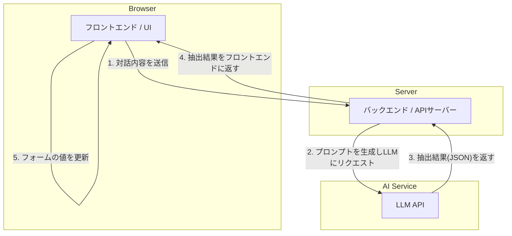

# AIエージェントによるフォーム自動入力システムの設計案
ユーザーが自然言語で話す（入力する）だけで、システムがその内容を理解し、必要な情報をフォームの適切な項目に自動でセットすることを目指します。これにより、ユーザーの入力負担を大幅に軽減し、より直感的で効率的なデータ入力を実現します。

## 1. 設計思想とユーザー体験（UX）
- **直感的な入力**: ユーザーは項目の意味や入力形式を意識することなく、話すように情報を入力できます。

- **入力負担の軽減**: 複数の項目にまたがる情報を一度の対話で入力できるため、クリックやタブ移動の手間が省けます。

- **専門業務の支援**: 例えば福祉の現場では、専門用語を含む長い申し送り事項から、アセスメントシートの各項目に必要な情報だけを抽出してセットするなど、業務知識を補完する使い方が可能です。

## 2. システムアーキテクチャ

システム全体は、**フロントエンド**、**バックエンド**、そして外部の**AIエージェント**の3層で構成されます。

## 3. フロントエンド設計
### 画面レイアウト
画面を左右に分割した2カラムレイアウトを採用します。

右ペイン: 対話エリア (AIエージェント)

チャット形式のUIで、ユーザーはここに自然言語で指示や情報を入力します。

AIからの応答や質問もここに表示されます。

左ペイン: 入力フォームエリア

従来のWebフォームを配置します。

AIによって自動入力された箇所は、色を変えてハイライトするなど、ユーザーが視覚的に認識できるように工夫します。

### 状態管理
フォームの入力値、チャットの履歴、通信状態などを一元的に管理します。ReactであればZustandやRedux Toolkit、VueであればPiniaなどの状態管理ライブラリの利用を推奨します。これにより、AIからの応答に応じてフォームの状態をスムーズに更新できます。

## 4. バックエンド設計
バックエンドの役割は、フロントエンドとAIエージェントを仲介し、情報抽出のコアロジックを実行することです。

### APIエンドポイント例
シンプルなAPIを1つ用意します。

POST /api/extract-and-fill

リクエスト:

conversation_history: これまでの対話履歴

current_user_input: 今回のユーザー入力

form_schema: 抽出対象となるフォーム項目の定義（JSON Schema形式）

レスポンス:

extracted_data: 抽出されたキーと値のペア (例: {"name": "田中太郎", "birthdate": "1980-04-01"})

ai_response_message: ユーザーへの返答メッセージ (例: 「お名前と生年月日をセットしました。」)

### 情報抽出のコアロジック (プロンプトエンジニアリング)
AIエージェントから意図した形式で情報を引き出すための**プロンプト（指示文）**設計が最も重要です。

役割の定義: AIに「あなたは優秀なアシスタントです」といった役割を与えます。

目的の指示: 「以下のユーザー入力から、指定されたJSONスキーマに従って情報を抽出してください」と明確に指示します。

抽出ルールの提示: 抽出対象となるフォームの項目情報をJSON Schemaのような形式で渡します。これにより、AIは何を抽出すべきかを正確に理解します。

出力形式の指定: 抽出結果を必ずJSON形式で返すように厳密に指示します。

ユーザー入力の提示: 最後に、ユーザーが入力したテキストを渡します。